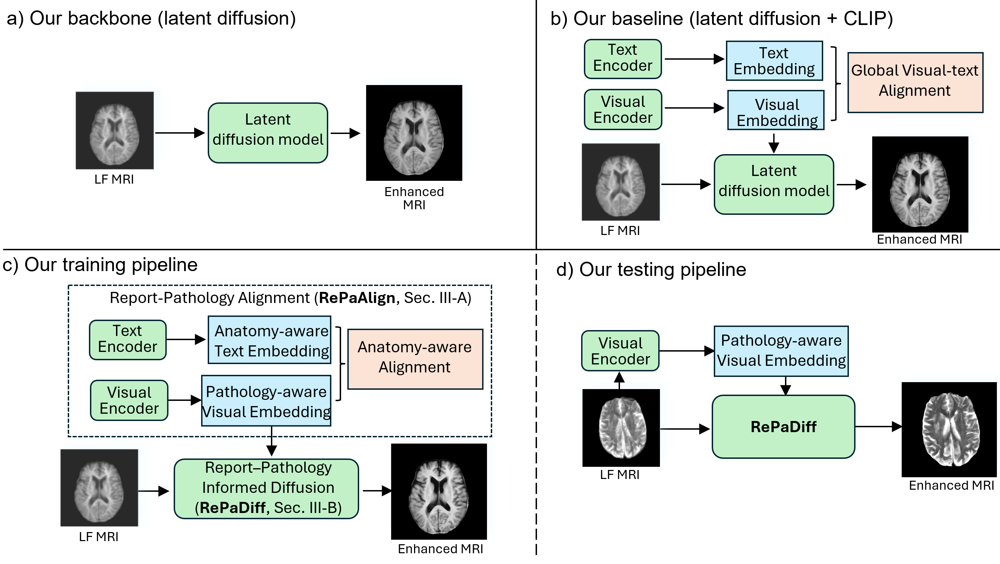
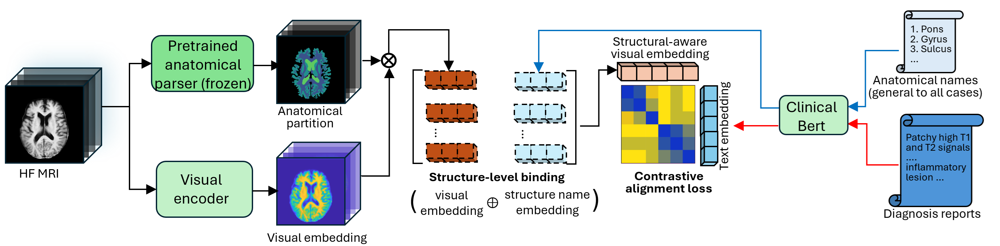
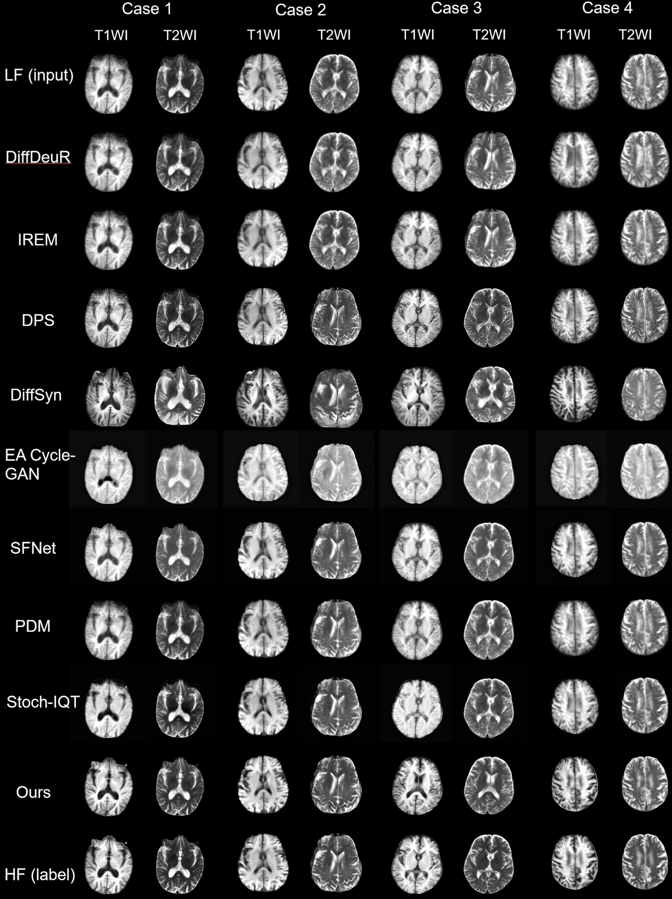

# Pathology-Aware Latent Diffusion for Low-Field Brain MRI Enhancement
[]()
[]()
[]()

Official implementation of the paper:

**Pathology-Aware Latent Diffusion for Low-Field Brain MRI Enhancement**  
Dong Zhang, Caohui Duan, Xiaonan Xu, Youmin Li, Junming Huang, Chao Wang, Z. Jane Wang, Xin Lou  
Submitted to IEEE Transactions on Medical Imaging (TMI)

---

## Overview

Low-field MRI (LF-MRI) improves imaging accessibility and reduces hardware cost, but suffers from reduced signal-to-noise ratio (SNR) and degraded anatomical detail.

Most existing enhancement approaches rely solely on image supervision and may fail to preserve pathology-relevant structures.

We propose **RePaMed**, a **pathology-aware latent diffusion framework** that integrates **diagnostic report semantics** to guide MRI enhancement.

The key idea is to align **region-level MRI representations with diagnostic report semantics**, and incorporate the aligned representations into a **diffusion-based reconstruction model**.

<p align="center">

</p>

---

## Framework

<p align="center">

</p>

---

RePaMed consists of two key components:

### 1. RePaAlign

A **region-aware image–text alignment module** that aligns brain MRI structures with diagnostic report semantics.

Key techniques:

- Structure-wise representation pooling
- Anatomical region masking
- Targeted negative sampling
- Contrastive alignment between MRI regions and report descriptions

This step produces **semantically aligned representations**.

---

### 2. RePaDiff

A **latent diffusion-based enhancement model** that integrates semantic guidance during reconstruction.

Key techniques:

- Latent diffusion enhancement
- Curriculum-based semantic conditioning
- Progressive integration of pathology-aware features

This allows the model to enhance MRI images while preserving clinically relevant structures.

---

## Features

- Pathology-aware MRI enhancement
- MRI–report multimodal alignment
- Region-guided representation learning
- Diffusion-based reconstruction
- Designed for **low-field brain MRI enhancement (T1WI and T2WI)**

---

## Installation

Clone the repository

```bash
git clone https://github.com/D0ngZhang/RePaMed.git
cd RePaMed
```

Install dependencies

```bash
conda create -n repamed python=3.9
conda activate repamed
pip install -r requirements.txt
```

## Dataset Preparation

## Testing

During inference, each low-field MRI volume is first resampled to a fixed resolution and decomposed into axial 2D slices.  
For each slice, the model extracts:

- structural conditioning features via the low-field encoder, and
- semantic context features via the semantic encoder.

These conditions are fed into a DDIM-based latent diffusion sampler to generate a high-field-like latent representation, which is then decoded by the VAE decoder into the reconstructed slice. The reconstructed slices are stacked back into a 3D volume and saved as synthesized T1/T2 NIfTI files.

### Testing Data Preparation

The testing script expects each subject to contain both low-field (LF) and high-field (HF) MRI scans for two modalities: **T1** and **T2**.  
All volumes must be stored in **NIfTI format (.nii.gz)**.

### Directory Structure

All subjects should be organized in the same folder:

```text
test_dataset/
├── subject_001_HF_T1.nii.gz
├── subject_001_HF_T2.nii.gz
├── subject_001_LF_T1.nii.gz
├── subject_001_LF_T2.nii.gz
├── subject_002_HF_T1.nii.gz
├── subject_002_HF_T2.nii.gz
├── subject_002_LF_T1.nii.gz
└── subject_002_LF_T2.nii.gz
```

### Pretrained Model

We provide pretrained checkpoints for the RePaMed model, VAE, and semantic encoder.

## Pretrained Checkpoints

| Model | Description | Download |
|------|-------------|---------|
| RePaMed | Model for the entire framework | Google Drive |
| VAE | Model for VAE to train latent diffusion | [Google Drive](https://drive.google.com/file/d/1rlwd1mVBoEg_LXMdIhk8qL4PUj87MUAw/view?usp=sharing) |
| RepaAlign | Model for RePaAlign to align reports and images | [Google Drive](https://drive.google.com/file/d/1L4S0YLl9dyW9AyIpArMO06xqbH9hOv8V/view?usp=sharing) |

### Checkpoint Structure

After downloading, place the RePaMed checkpoint under: 'saved_models/'


```bash
python test.py \
  --dataset_test_path /path/to/test_data \
  --diffusion_ckpt saved_models/RePaMed.ckpt \
  --save_root /path/to/save_outputs \
  --S 50 \
  --eta 0.0 \
  --device cuda
```

### Notes

- The model performs **slice-wise inference**. Each 3D volume is decomposed into axial slices before diffusion-based reconstruction.
- The output will be saved as synthesized high-field MRI volumes:
**Syn_T1.nii.gz**
**Syn_T2.nii.gz**
for each subject.

# Supplementary Material  

# S1 Data Preparation Details

## S1.1 Data Acquisition

### Table S1. Dataset characteristics across sites

<h3>Dataset characteristics across sites</h3>

<table>
<tr>
<th rowspan="2">Hospital</th>
<th colspan="3">Training and validation</th>
<th colspan="2">Testing</th>
</tr>

<tr>
<th>PLA General</th>
<th>Guizhou Electrical</th>
<th>Raohe County</th>
<th>PLA General</th>
<th>Beian Central</th>
</tr>

<tr>
<td>No. MRIs</td>
<td>80,222</td>
<td>1,230</td>
<td>485</td>
<td>1,392</td>
<td>54</td>
</tr>

<tr>
<td>No. patients</td>
<td>68,754</td>
<td>922</td>
<td>485</td>
<td>1,392</td>
<td>54</td>
</tr>

<tr>
<td>Field strength (T)</td>
<td>3.0</td>
<td>0.4</td>
<td>0.35</td>
<td>3.0 / 0.3–0.4</td>
<td>3.0 / 0.3</td>
</tr>

<tr>
<td>Time</td>
<td>2018–2023</td>
<td>2021–2024</td>
<td>2018–2024</td>
<td>2023</td>
<td>2025</td>
</tr>

<tr>
<td>Patient age (y)</td>
<td>56.9 ± 18</td>
<td>55.4 ± 14</td>
<td>N/A</td>
<td>58.3 ± 15</td>
<td>59.5 ± 6</td>
</tr>

<tr>
<td>Male (%)</td>
<td>49.5</td>
<td>62.9</td>
<td>48.1</td>
<td>51.2</td>
<td>64.8</td>
</tr>

<tr>
<td>MRI scanner</td>
<td>GE, Philips, Siemens</td>
<td>Hitachi</td>
<td>Time Medical</td>
<td>GE, Siemens</td>
<td>Siemens / Hitachi</td>
</tr>

<tr>
<td>Pixel spacing (mm)</td>
<td>0.47 × 0.47 × 7.0</td>
<td>0.86 × 0.86 × 7.0</td>
<td>0.57 × 0.57 × 8.5</td>
<td>0.47 × 0.47 × 7.0 / 0.94 × 0.94 × 7.0</td>
<td>0.43 × 0.43 × 7.15 / 0.86 × 0.86 × 7.15</td>
</tr>

<tr>
<td>Dimensions</td>
<td>512 × 512 × 21</td>
<td>256 × 256 × 20</td>
<td>420 × 420 × 15</td>
<td>512 × 512 × 21 / 256 × 256 × 21</td>
<td>512 × 512 × 19 / 256 × 256 × 19</td>
</tr>

</table>
Training and validation data were collected from one tertiary hospital and two secondary hospitals. HF MRI data were acquired at the Chinese PLA General Hospital using multiple scanners.

Real LF MRI data (0.35–0.4T) were collected from two secondary hospitals and used:

- to calibrate simulation parameters  
- to train unpaired enhancement baselines

Independent testing data were collected from PLA General Hospital and Beian Central Hospital.

Since PLA provides only 3T MRI, paired LF data were simulated using the degradation pipeline. Beian Central Hospital provides real paired HF/LF acquisitions for cross-domain evaluation.

---

# S1.2 MRI Pre-processing

All MRIs were preprocessed using the following pipeline:

1. **Anonymization** to remove patient identifiers  
2. **Skull stripping** to isolate intracranial tissue  
3. **N4 bias field correction** to reduce intensity inhomogeneity  
4. **Cropping** to fixed spatial size  

HF: `[448 × 448 × 18]`  
LF: `[224 × 224 × 18]`

The same pipeline was applied to training and test datasets.

---

# S1.3 Radiology Report Filtering and Cleaning

Reports were filtered to remove invalid cases containing keywords such as:

- “preoperative localization”
- severe motion blur descriptions

Remaining reports were cleaned using a locally deployed **Qwen3-235B** model to:

- remove extracranial content
- remove redundant normal findings
- preserve abnormal locations and diagnostic conclusions

All cleaned reports were manually verified by clinicians.

---

# S1.4 Physics-Inspired LF MRI Degradation

Realistic LF MRI was simulated from HF MRI using a physics-inspired pipeline.

## Tissue-aware SNR modeling

HF MRIs were segmented into four tissue classes using **FreeSurfer**:

- White Matter (WM)
- Gray Matter (GM)
- CSF
- Others

Empirically measured SNR ranges:

| Tissue | SNR |
|---|---|
| WM | 12–15 |
| GM | 10–12 |
| CSF | 5–6 |
| Others | 8–9 |

Noise was injected proportional to signal intensity.

---

## Resolution degradation

Images were resampled to [224 × 224 × 18] 
An anisotropic Gaussian kernel (σ=0.5–1.3) simulated slice-profile blurring.

---

## Bias-field simulation

Multiplicative bias fields were generated using polynomial functions (degree 2–4).

Coefficient range:
0.08 – 0.28


---

## Artifact injection

Low-probability artifacts were added:

- ghosting
- RF spikes
- bias field shifts

Final LF images were normalized to `[0,1]`.

---

# S1.5 Anatomical Parser Training

FreeSurfer labels were mapped into **25 anatomical structures**.

Using **2,560 labeled MRIs**, a **SwinUNETR** segmentation network was trained.

The trained model is used for:

- region-wise evaluation
- anatomical consistency analysis

---

# S2 Implementation Details

## S2.1 RePaAlign — Report–Pathology Alignment

### Visual encoder

Architecture:
ResNet-18 + Feature Pyramid Network + Convolutional Attention Module


Slice features are aggregated into structure-wise embeddings using mask-weighted pooling.

Each embedding is concatenated with its anatomical name embedding obtained from **clinical BERT**.

---

### Report encoder and contrastive learning

Reports are encoded using **medbert-base-wwm-chinese**.

Contrastive learning uses structured hard negatives:

- anatomical entity remapping
- sentence shuffling
- cross-patient substitution
- hybrid mixing

Training objective: bidirectional image–text contrastive loss


After training:

- report encoder removed
- visual encoder frozen
- reused by RePaDiff

---

# S2.2 RePaDiff — Pathology-Aware Diffusion

## Latent diffusion backbone

Based on **Latent Diffusion Model (LDM)**.

A VAE is pretrained on HF MRI.

Latent size: [8 x 56 x 56]


---

## Conditioning signals

Two conditioning inputs:

**1. Structural conditioning**

LF encoder projects LF MRI into latent space.

**2. Semantic conditioning**

RePaAlign visual encoder extracts pathology embeddings.

Embedding size: [1 x 128]


---

## Curriculum Conditioning Injection (CCI)

Semantic embeddings are injected through cross-attention.

A time-dependent coefficient gradually increases during diffusion steps:

early → structure reconstruction
late → pathology refinement


---

## Optimization

Training objective: denoising score matching


Trainable modules:

- LF encoder
- conditional UNet

Frozen modules:

- VAE
- visual encoder

---

## Training configuration

| Parameter | Value |
|---|---|
| Framework | PyTorch |
| GPUs | 4 × NVIDIA A100-80GB |
| RePaAlign optimizer | Adam |
| RePaDiff optimizer | AdamW |
| Learning rate | 1e-4 |
| Diffusion steps (train) | 1000 |
| Diffusion steps (test) | 50 |

Training can also run on **RTX 4090** using gradient accumulation.

---

# S3 Complete Results

## Quantitative results

Table S2 reports pixel-level metrics.

Metrics:

- MSE
- MAE
- SSIM
- PSNR
- LPIPS
- HFEN
- GMSD

The proposed method achieves the best trade-off between structural fidelity and perceptual quality.

---

## Structural consistency

Table S3 reports **Relative Volume Error (RVE)** for six brain tissues:

- White matter
- Cortical gray matter
- Subcortical nuclei
- Cerebellum
- Brainstem
- Ventricle

Lower RVE indicates better anatomical consistency.

---

# Visual Comparisons

### Fig S1 — Simulated LF MRI

<p align="center">
<br>
<em>Comparison of LF-to-HF enhancement methods on simulated LF MRI. The proposed method preserves anatomical boundaries and suppresses noise.</em>
</p>


---

### Fig S2 — Real LF MRI

<p align="center">
<br>
<em>Results on real LF MRI from secondary hospitals. The proposed method generates clearer tissue contrast and fewer artifacts.</em>
</p>

---

### Fig S3 — Segmentation overlays

<p align="center">
<br>
<em>Segmentation contours for ventricles and brainstem.</em>
</p>

---

### Fig S4 — Error maps and attention

<p align="center">
<br>
<em>The proposed method produces more localized reconstruction errors and anatomically meaningful attention.</em>
</p>

---
